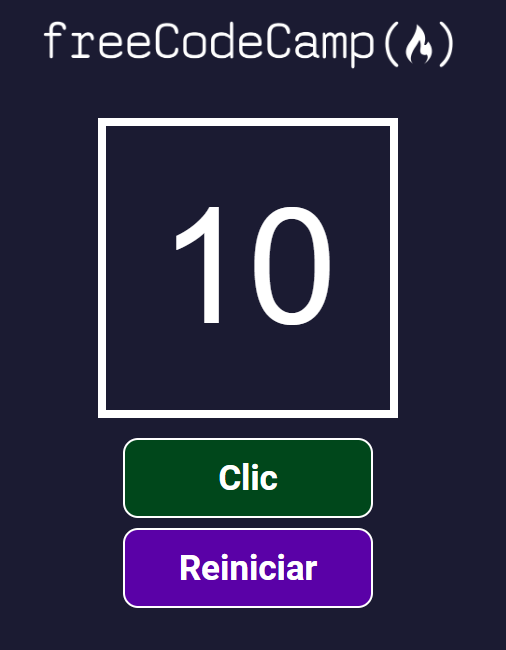

# Aplicación contador de clics

El Contador está creado con React, el cual tiene tres componentes, la visualización del contador y dos botones, uno para sumar al contador y el otro reinicia su conteo.

Con este proyecto se logró aprender algunos fundamentos de React como el estado de un componente y el método addEventListener, de igual forma definir funciones en un componente y pasar funciones como props, utilizar hooks como el useState.

## Ejecutar el proyecto

1. Ya que el proyecto contien dependencias para su funcionamiento, lo primero sería instalar las biblitecas requeridas con el siguiente comando `npm install`
2. En el archivo `package.json` se encuentran los scripts para la ejecución del proyecto. Usaremos el script `npm start`
3. La aplicación se ejecutará en la dirección [http://localhost:3000](http://localhost:3000)
4. En el navegador de su preferencia vaya a la ruta indicada y podrá ver la aplicación

## Tareas por hacer

1. Actualizar el proyecto para que use Vite (create-react-app ya está descontinuado)
2. Actualizar el proyecto para que use Tipescript
3. Actualizar el proyecto para que use Tailwind Css
